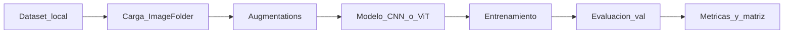

# Proyecto: Detección de defectos en superficies metálicas industriales

## 1. Introducción y objetivo

La inspección visual de calidad en manufactura metálica es crítica para evitar piezas defectuosas en la cadena de producción. Tradicionalmente depende de operadores humanos; este proyecto plantea automatizarla con visión por computador.

**Objetivo:** entrenar y comparar modelos de clasificación de imágenes capaces de distinguir superficies metálicas normales de cuatro tipos de defecto (rayadura, grieta, óxido y agujero), usando un dataset sintético balanceado de 15.000 imágenes en escala de grises.

**Fuente de datos:** [Synthetic Industrial Metal Surface Defects](https://www.kaggle.com/datasets/tatheerabbas/synthetic-industrial-metal-surface-defects) (Tatheer Abbas, Kaggle).

---

## 2. Descripción del dataset

### 2.1 Resumen

| Atributo | Valor |
|----------|--------|
| Nombre | Synthetic Industrial Metal Surface Defect Dataset |
| Autor | Tatheer Abbas |
| Año | 2026 |
| Total de imágenes | 15.000 |
| Resolución | 256 × 256 px |
| Formato | PNG, 8-bit, escala de grises (0–255) |
| Clases | 5 (balanceadas) |
| Split | train 80% (12.000) / val 20% (3.000) |
| Semilla maestra | 42 |
| Licencia | CC BY 4.0 |

### 2.2 Clases

| Clase | Descripción |
|-------|-------------|
| `normal` | Superficie sin defectos |
| `scratch` | Marcas lineales de abrasión |
| `crack` | Patrones de fractura ramificados |
| `rust` | Parches de corrosión |
| `hole` | Perforaciones / agujeros |

Distribución por clase: **3.000 imágenes** (2.400 train + 600 val). El balance está validado (`balance_ok: true` en `config.json`).

### 2.3 Estructura en este proyecto

En Kaggle el dataset se publica bajo `images/train` y `images/val`. En el workspace local las imágenes están en:

```
industrial_defect_dataset/
├── train/
│   ├── normal/     # 2.400
│   ├── scratch/    # 2.400
│   ├── crack/      # 2.400
│   ├── rust/       # 2.400
│   └── hole/       # 2.400
└── val/
    └── {class}/    # 600 cada una
```

Archivos de soporte en la raíz:

- `metadata.csv` — metadatos por imagen
- `config.json` — configuración y estadísticas de generación
- `README.md` — documentación original del dataset

### 2.4 Metadatos disponibles

Columnas principales de `metadata.csv`:

| Columna | Descripción |
|---------|-------------|
| `filename` | Nombre del archivo |
| `class` | Tipo de defecto / normal |
| `split` | `train` o `val` |
| `texture_type` | `brushed`, `matte` o `grain` |
| `base_intensity` | Brillo promedio |
| `lighting_angle` | Dirección de la luz (grados) |
| `noise_strength` | Intensidad de ruido |
| `defect_count` | Número de defectos |
| `defect_coverage_pct` | % de área afectada |
| `defect_positions` / `defect_sizes_px` | Posición y tamaño aproximados |
| `generation_seed` | Semilla de reproducibilidad |

Estos campos permiten análisis secundarios (robustez ante textura/iluminación, correlación cobertura–dificultad), aunque la tarea principal es clasificación por carpeta.

---

## 3. Requisitos y planteamiento del problema

### 3.1 Formulación

| Elemento | Especificación |
|----------|----------------|
| Tipo de problema | Clasificación supervisada multi-clase |
| Entrada | Imagen grayscale 256 × 256 |
| Salida | Una etiqueta ∈ `{normal, scratch, crack, rust, hole}` |
| Frameworks sugeridos | PyTorch (`ImageFolder`) o TensorFlow (`image_dataset_from_directory`) |

### 3.2 Métricas de evaluación

- **Accuracy** — métrica global (válida por el balance de clases).
- **F1 macro / weighted** — rendimiento por clase sin sesgo a una sola etiqueta.
- **Matriz de confusión** — errores entre defectos visualmente similares (p. ej. `scratch` vs `crack`).
- **Recall por clase** — prioritario en industria: fallar un defecto (falso negativo) suele costar más que un falso positivo.

### 3.3 Consideraciones técnicas

1. **Datos sintéticos:** facilitan volumen y balance, pero puede existir *sim-to-real gap* si se despliega en piezas reales.
2. **Transfer learning:** los pesos ImageNet esperan 3 canales; conviene replicar el canal grayscale a RGB (`L → RGB`) o adaptar la primera capa convolucional.
3. **Sin split test oficial:** el dataset solo define `train`/`val`. Para reporte final se puede reservar un hold-out desde `train` o tratar `val` como test y validar con cross-validation estratificada.
4. **Sin máscaras de segmentación:** no es un dataset de detección/segmentación por diseño. Aun así, `defect_positions` / `defect_sizes_px` permitieron derivar bounding boxes aproximadas (refinadas con segmentación OpenCV) con las que se entrenó un detector YOLOv8n para la demo web — con reservas metodológicas: las métricas de detección son exploratorias, no un benchmark estándar.

---

## 4. Modelos de visión recomendados

La resolución 256×256 y el tamaño del conjunto (15k) son adecuados para CNN clasificadoras con fine-tuning. No hace falta entrenar desde cero salvo como ablación.

### 4.1 Comparativa

| Prioridad | Modelo | Por qué encaja |
|-----------|--------|----------------|
| Baseline fuerte | ResNet-18 / ResNet-50 | Estándar de referencia, fine-tuning sencillo, amplio soporte |
| Mejor accuracy/coste | EfficientNet-B0 / B2 | Buen trade-off en 256×256; eficiente en parámetros y FLOPs |
| Ligero / edge | MobileNetV3-Small / EfficientNet-Lite | Candidatos a despliegue en línea de producción con pocos recursos |
| CNN moderna | ConvNeXt-Tiny | Alto rendimiento con pipeline de entrenamiento similar a CNN clásicas |
| Transformer | ViT-Tiny / DeiT-Small | Comparar atención vs convoluciones; requiere augmentations/regularización cuidadosa |
| Alternativa no supervisada | PatchCore / PaDiM | Solo si se reformula el problema como anomalía (`normal` vs defecto) |

### 4.2 Selección para ejecutar el proyecto

Entrenar y comparar tres modelos:

1. **ResNet-18** — baseline robusto y rápido.
2. **EfficientNet-B0** — candidato a mejor accuracy/coste.
3. **MobileNetV3-Small** — referencia de latencia / despliegue.

Protocolo común:

- Preentrenamiento ImageNet.
- Entrada: grayscale replicado a 3 canales.
- Cabeza de clasificación con 5 salidas.
- Optimizador AdamW o SGD + momentum; early stopping sobre val F1 macro.
- Augmentations ligeras (ver sección 5).

### 4.3 Cuándo usar otros enfoques

- **ConvNeXt / ViT:** si el baseline CNN ya satura y se busca empujar accuracy o un estudio de arquitecturas.
- **PatchCore / PaDiM:** si el interés industrial es “¿hay anomalía?” sin tipificar el defecto, o para comparar supervisión completa vs detección de anomalías.
- **Segmentación / detección (U-Net, YOLO):** implementada a nivel exploratorio en la demo web: YOLOv8n entrenado con etiquetas derivadas de metadata (`src/train_yolo.py`), con las reservas metodológicas de la sección 3.3.

---

## 5. Pipeline sugerido



### 5.1 Carga

- PyTorch: `torchvision.datasets.ImageFolder` sobre `industrial_defect_dataset/train` y `.../val`.
- TensorFlow: `tf.keras.utils.image_dataset_from_directory` con `color_mode='grayscale'` o conversión a RGB para transfer learning.

### 5.2 Augmentaciones recomendadas

Apropiadas (preservan tipología del defecto):

- Horizontal / vertical flip
- Rotación pequeña (±15°)
- Ajuste leve de brillo y contraste
- Ruido gaussiano suave (opcional)

Evitar o usar con cuidado:

- Distorsiones elásticas fuertes
- Crop agresivo que elimine defectos pequeños
- Color jitter extremo (las imágenes son grayscale)

### 5.3 Entrenamiento y comparación

1. Fijar semillas y splits.
2. Entrenar los tres modelos con hiperparámetros comparables (épocas máximas, batch size, scheduler).
3. Reportar accuracy, F1 macro, recall por clase y matriz de confusión en `val`.
4. Opcional: estratificar resultados por `texture_type` o `lighting_angle` usando `metadata.csv`.

---

## 6. Riesgos y limitaciones

| Riesgo / limitación | Impacto | Mitigación |
|---------------------|---------|------------|
| Datos sintéticos | Modelos pueden no generalizar a metal real | Validación externa con imágenes reales si están disponibles; documentar el gap |
| Solo train/val | Sobreajuste al split de validación | Hold-out interno o k-fold estratificado |
| Sin máscaras | No se puede evaluar segmentación de forma rigurosa | Mantener el alcance en clasificación |
| Defectos sutiles | `scratch`/`crack` pueden confundirse | Analizar errores; ajustar augmentations y umbrales por clase |
| Resolución fija 256×256 | Detalle fino limitado | Upscaling no aporta información real; priorizar arquitecturas eficientes a esa escala |

---

## 7. Referencias

- Dataset Kaggle: https://www.kaggle.com/datasets/tatheerabbas/synthetic-industrial-metal-surface-defects
- Documentación local: `README.md`, `config.json`, `metadata.csv`
- Licencia: **CC BY 4.0** (uso libre con atribución)

```bibtex
@dataset{synthetic_metal_defects_2026,
    title = {Synthetic Industrial Metal Surface Defect Dataset},
    author = {Tatheer Abbas},
    year = {2026}
}
```
