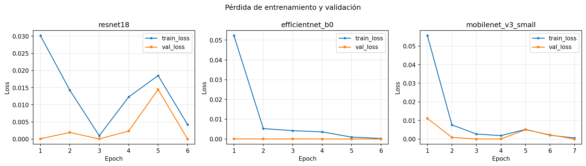
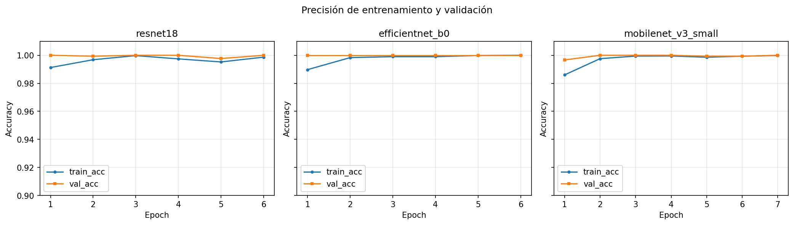
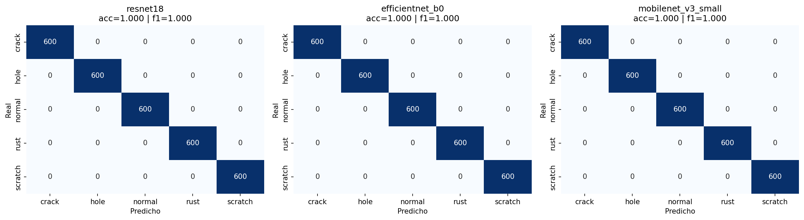
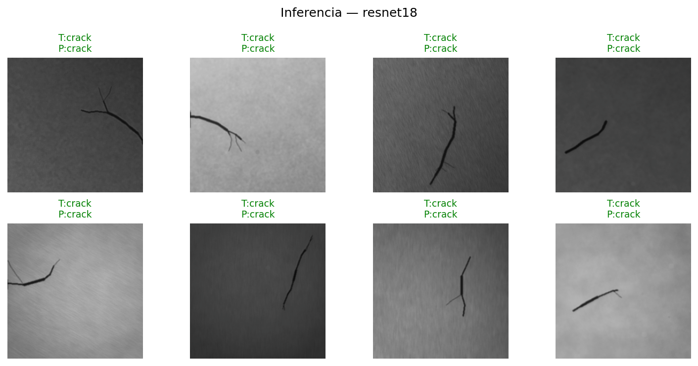

# Visión computacional: defectos en superficies metálicas

Proyecto de clasificación multi-clase de defectos industriales en metal usando transfer learning (PyTorch + CUDA).

**Dataset:** [Synthetic Industrial Metal Surface Defects](https://www.kaggle.com/datasets/tatheerabbas/synthetic-industrial-metal-surface-defects) (Tatheer Abbas, CC BY 4.0) — 15.000 imágenes PNG 256×256 en escala de grises, 5 clases balanceadas (`normal`, `scratch`, `crack`, `rust`, `hole`).

Documentación del planteamiento: [`DOCUMENTO_PROYECTO.md`](DOCUMENTO_PROYECTO.md).

## Modelos

| Modelo | Rol |
|--------|-----|
| ResNet-18 | Baseline |
| EfficientNet-B0 | Mejor trade-off accuracy/coste |
| MobileNetV3-Small | Ligero / edge |

Entrenamiento con ImageNet pretrained, AMP en `cuda:0`, early stopping sobre F1 macro.

## Cómo ejecutar

```bash
pip install -r requirements.txt
jupyter notebook entrenar_modelos.ipynb
```

Requisitos: Python 3.12+, PyTorch con CUDA. El notebook exige GPU (`DEVICE = cuda:0`).

Estructura relevante:

```
├── industrial_defect_dataset/   # train/ + val/
├── entrenar_modelos.ipynb       # pipeline de entrenamiento
├── docs/figures/                # gráficos e imágenes del experimento
├── DOCUMENTO_PROYECTO.md
└── requirements.txt
```

## Resultados (validación)

| Modelo | Params | Epochs | Tiempo (min) | Accuracy | F1 macro | Val loss |
|--------|--------|--------|--------------|----------|----------|----------|
| ResNet-18 | 11.2M | 6 | 4.95 | 1.0000 | 1.0000 | 0.000101 |
| EfficientNet-B0 | 4.0M | 6 | 7.72 | 1.0000 | 1.0000 | 0.000038 |
| MobileNetV3-Small | 1.5M | 7 | 6.19 | 1.0000 | 1.0000 | 0.000894 |

> Métricas de validación generadas por `entrenar_modelos.ipynb` (detalle en `outputs/comparison_summary.csv`, no versionado).

### Imágenes procesadas (batch de entrenamiento)


### Pérdida (train vs val)



### Precisión (train vs val)



### Matrices de confusión



### Inferencia del mejor modelo



## Licencia

Dataset bajo **CC BY 4.0** (atribución a Tatheer Abbas). Código del proyecto para uso académico del módulo.
