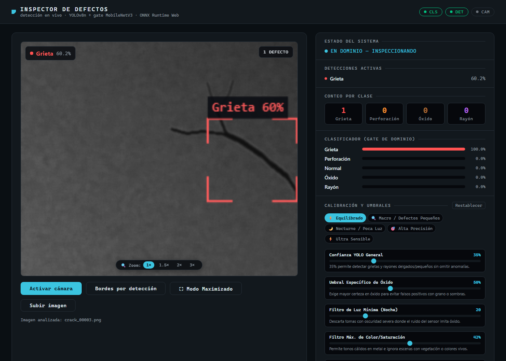
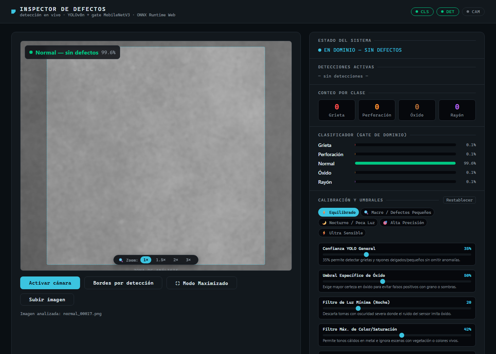
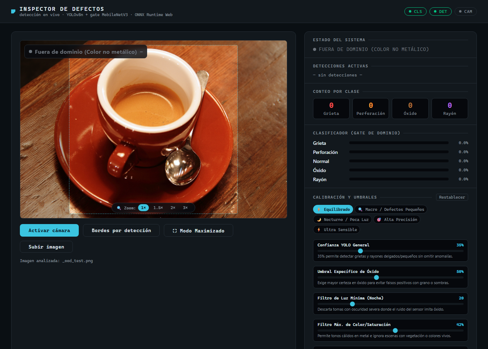
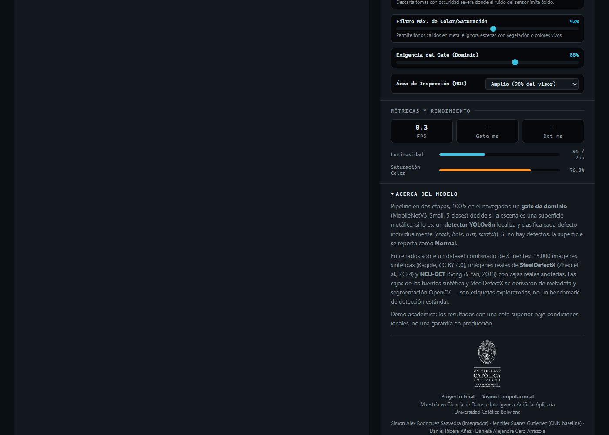

<p align="center">
  <picture>
    <source media="(prefers-color-scheme: dark)" srcset="docs/figures/brand/ucb-logo-dark.png">
    
  </picture>
</p>

# Visión computacional: detección y clasificación de defectos en superficies metálicas

**Proyecto Final — Módulo Visión Computacional** · Maestría en Ciencia de Datos e Inteligencia Artificial Aplicada · **Universidad Católica Boliviana**

> **Problema:** dada una imagen (o el video en vivo de una cámara) de una superficie metálica, decidir automáticamente si la pieza está en condiciones normales o presenta defectos —grietas, perforaciones, óxido o rayones— y **localizar cada defecto** con su caja y tipo, para apoyar la decisión de aceptar o reprobar la pieza en una línea de inspección de calidad.

## Equipo

| Integrante | Rol |
|:---|:---|
| **Simon Alex Rodriguez Saavedra** | Líder / Integrador |
| **Jennifer Suarez Gutierrez** | Entrenamiento de la red neuronal CNN baseline |
| **Daniel Ribera Añez** | Contribuidor |
| **Daniela Alejandra Caro Arrazola** | Contribuidora |

**Docente:** Ing. Msc. Erick Maraz

**Informe técnico (artículo científico, Entregable A):** [`informe/main.pdf`](informe/main.pdf) — fuente LaTeX en [`informe/main.tex`](informe/main.tex).

Proyecto integral de detección de objetos y clasificación multi-clase de defectos industriales en metal: combina un **Gate clasificador de dominio** (MobileNetV3-Small) y un **detector YOLOv8n en tiempo real** entrenados con aceleración por hardware (**GPU NVIDIA GeForce RTX 5060 Ti**) sobre datasets combinados sintéticos y reales.

### Demostración de inferencia en CPU

El notebook `notebooks/inferencia_cpu.ipynb` permite reproducir la inferencia utilizando los pesos del modelo previamente entrenado, ejecutándose únicamente en CPU y sin necesidad de volver a entrenar el modelo.

🎥 **Video de demostración:** https://drive.google.com/file/d/1O94ky6UKPWkSiXQzo2UVIzXWf3W3IRCk/view?usp=sharing 

## Datasets, Fuentes y Créditos Académicos

Para garantizar máxima precisión y capacidad de generalización frente a texturas reales, grano de sensor, iluminación variable y variaciones microscópicas de defectos, este proyecto integra y da crédito a las siguientes bases de datos etiquetadas:

### 1. Synthetic Industrial Metal Surface Defects
- **Autor:** Tatheer Abbas (Kaggle).
- **Licencia:** [Creative Commons Attribution 4.0 International (CC BY 4.0)](https://creativecommons.org/licenses/by/4.0/).
- **Enlace:** [Kaggle Dataset](https://www.kaggle.com/datasets/tatheerabbas/synthetic-industrial-metal-surface-defects).
- **Descripción:** 15.000 imágenes PNG $256 \times 256$ en escala de grises, 5 clases perfectamente balanceadas (`normal`, `scratch`, `crack`, `rust`, `hole`), con metadatos asociados (`metadata.csv`) sobre centros, áreas de defecto y parámetros de textura/iluminación.

### 2. SteelDefectX (A Real-World Benchmark Dataset for Steel Surface Defect Detection)
- **Autores:** Zhao et al. (2024).
- **Repositorio:** [Hugging Face Zhaosxian/SteelDefectX](https://huggingface.co/datasets/Zhaosxian/SteelDefectX).
- **Descripción:** 5.454 imágenes reales capturadas en líneas de producción industrial de acero laminado en caliente y frío. Aporta muestras con reflectancia metálica real, ruido de rodillo y defectos auténticos categorizados y mapeados al proyecto:
  - `Crazing`, `Crease`, `Waist folding` $\rightarrow$ **`crack`** (grietas y fisuras).
  - `Bright scratch`, `Dark scratches`, `Finishing roll printing` $\rightarrow$ **`scratch`** (rayones superficiales).
  - `Secondary rust skin`, `White rust`, `Pitted surface`, `Rolled in scale`, `Red iron sheet`, `Oxide scale` $\rightarrow$ **`rust`** (óxido, corrosión y picaduras).
  - `Punching`, `Inclusion`, `Slag inclusion`, `Patches`, `Crescent gap`, `Rolled pit` $\rightarrow$ **`hole`** (perforaciones, oquedades e inclusiones).

### 3. NEU Surface Defect Database (NEU-DET / NEU-CLS)
- **Autores:** Kechen Song y Yunhui Yan (Northeastern University, Shenyang, China).
- **Cita Académica:**
  > Song, K., & Yan, Y. (2013). *A noise robust method based on completed local binary patterns for hot-rolled steel strip surface defect detection*. **Applied Surface Science**, 285, 858-864. DOI: [10.1016/j.apsusc.2013.09.002](https://doi.org/10.1016/j.apsusc.2013.09.002).
- **Descripción:** Benchmark académico de referencia para detección de defectos en bandas de acero laminadas en caliente (crazing, inclusion, patches, pitted surface, rolled-in scale, scratches).
- **Integración:** tercera fuente del dataset de detección YOLO — 1.770 imágenes reales $200 \times 200$ con **cajas reales anotadas** en formato Pascal VOC (XML), obtenidas del [mirror en GitHub](https://github.com/siddhartamukherjee/NEU-DET-Steel-Surface-Defect-Detection) (el dataset oficial tiene archivos faltantes/corruptos; de los 1.800 originales se recuperan 1.770 pares imagen/anotación). Mapeo de clases: `crazing` $\rightarrow$ **`crack`**, `scratches` $\rightarrow$ **`scratch`**, `rolled-in_scale` / `pitted_surface` $\rightarrow$ **`rust`**, `patches` / `inclusion` $\rightarrow$ **`hole`**.


### Cómo obtener y regenerar los datos

Los datasets **no se incluyen en el repositorio** (se excluyen vía `.gitignore` por su tamaño). Se descargan automáticamente con un solo comando:

```bash
# Descarga TODOS los datasets (sintético de Kaggle + reales de HuggingFace/GitHub)
python src/download_datasets.py
```

Esto descarga y organiza:
1. **Dataset sintético (Kaggle, 15.000 imágenes, ~356 MB):** requiere acceso a Kaggle. Necesitas:
   - Crear un API token en [Kaggle Settings](https://www.kaggle.com/settings) → "Create New Token" → guarda `kaggle.json`.
   - Colocarlo en `~/.kaggle/kaggle.json` (Linux/Mac) o `C:\Users\<usuario>\.kaggle\kaggle.json` (Windows).
   - El script descarga, descomprime y divide automáticamente en `industrial_defect_dataset/{train,val,test}/`.
2. **SteelDefectX (HuggingFace, ~480 imágenes):** se descarga automáticamente vía `huggingface_hub` (sin autenticación).
3. **NEU-DET (GitHub mirror, ~1.770 imágenes + XML):** se descarga y descomprime automáticamente.

> **Alternativa si no tienes Kaggle configurado:** descarga manualmente el dataset desde [Kaggle](https://www.kaggle.com/datasets/tatheerabbas/synthetic-industrial-metal-surface-defects), descomprime el ZIP y coloca las imágenes en `industrial_defect_dataset/` respetando la estructura `train/`, `val/`, `test/` por clase. Luego ejecuta solo los datasets reales:
> ```bash
> python src/download_datasets.py --solo-reales
> ```

Tras la descarga, construye el dataset combinado de detección YOLO:

```bash
python src/prepare_combined_dataset.py
```

Esto genera `yolo_dataset/` con las imágenes y etiquetas en formato YOLO, listo para entrenar.
---

## Entrenamiento en GPU (NVIDIA GeForce RTX 5060 Ti)

Todos los modelos se entrenan con aceleración de hardware dedicada:
- **GPU:** NVIDIA GeForce RTX 5060 Ti (CUDA 13.0 / PyTorch 2.13.0).
- **Precisión:** Automatic Mixed Precision (AMP `float16`) para máxima velocidad y eficiencia de memoria.
- **Optimizador:** SGD con momentum ($0.937$) y weight decay ($0.0005$).
- **Data Augmentation Avanzada:**
  - Variación de iluminación y tono: HSV jitter (`hsv_h=0.015`, `hsv_s=0.4`, `hsv_v=0.4`).
  - Transformaciones geométricas: Rotaciones (`degrees=10.0`), traslación (`translate=0.1`), escalado (`scale=0.2`), flips horizontales y verticales.
  - Multi-escala y mezcla: Mosaico multi-imagen (`mosaic=0.5`) y `mixup=0.1` para detección robusta de defectos pequeños.

---

## División del Dataset Combinado (Train / Val / Test)

División **80/10/10 estratificada** con semilla fija (`SEED = 42`) para garantizar reproducibilidad total:

| Partición | Imágenes Sintéticas | Reales (SteelDefectX) | Reales (NEU-DET) | Total Imágenes | Uso |
|:---|:---:|:---:|:---:|:---:|:---|
| **train** | 12.000 | 384 | 1.416 | **13.800** | Entrenamiento con Data Augmentation en GPU |
| **val** | 1.500 | 48 | 177 | **1.725** | Early stopping y selección de mejor checkpoint |
| **test** | 1.500 | 48 | 177 | **1.725** | Evaluación final no vista |
| **Total** | **15.000** | **480** | **1.770** | **17.250** | |

> **Nota de versionado:** el `web/detector.onnx` desplegado y las métricas de detección reportadas abajo corresponden al entrenamiento sobre este dataset de **3 fuentes** (17.250 imágenes; el split de test incluye 177 imágenes reales de NEU-DET con cajas anotadas). Una corrida histórica de 100 épocas sobre la versión anterior de 2 fuentes (`outputs/yolo/train-3`, 15.480 imágenes) alcanzó `mAP50 ≈ 0.80` en su propio split de test.

---

## Arquitectura de Modelos

| Modelo | Tipo | Rol | Parámetros / Tamaño |
|:---|:---|:---|:---:|
| **MobileNetV3-Small** | Clasificador de Dominio (Gate) | Discrimina superficie metálica vs entorno fuera de dominio | 1.5M (~6.4 MB ONNX) |
| **YOLOv8n** | Detector de Objetos (Bounding Boxes) | Localiza y clasifica defectos individuales (`crack`, `hole`, `rust`, `scratch`) | 3.2M (~12.2 MB ONNX) |
| **ResNet-18** | Benchmark Clasificación | Comparativa de Transfer Learning | 11.2M |
| **EfficientNet-B0** | Benchmark Clasificación | Comparativa de Transfer Learning | 4.0M |
| **CNN Básica** | Baseline | Red convolucional entrenada desde cero | 391K |

---

## Demo Web en Tiempo Real (Cámara e Inspección)

Demo interactiva desplegada en GitHub Pages: **https://simonlexrs.github.io/vision-computacional/**

- **Inferencia en el Cliente:** Corre 100% en el navegador utilizando **ONNX Runtime Web** con WebAssembly multi-hilo a **20–30+ FPS**. Ninguna imagen o video sale del dispositivo.
- **Pipeline en Dos Etapas:**
  1. **Gate de Dominio (`model.onnx`):** Filtra fondos no metálicos y escenas fuera de dominio (OOD).
  2. **Detector YOLOv8n (`detector.onnx`):** Si la superficie es válida, detecta y acota cada defecto individualmente. Si no hay defectos, reporta claramente **`Normal — sin defectos` (Verde)**.
- **Lupa / Zoom de Inspección (1×, 1.5×, 2×, 3×):** Proyecta sub-regiones ROI en alta densidad al tensor YOLO ($256 \times 256$) para detectar defectos milimétricos y micro-fisuras.
- **Modo Maximizado Inmersivo (HUD):** Permite ver la cámara a pantalla completa (`100vw × 100dvh`) con controles flotantes de zoom, bordes Sobel por clase y métricas de FPS en tiempo real.
- **Filtros Anti-Ruido Calibrados:** Protección contra falsos positivos nocturnos en sensor ISO y calibración por clase (umbral general al 35%, óxido al 50%).

### Capturas del testing (modelo desplegado)

Pruebas de extremo a extremo sobre la app desplegada, subiendo imágenes del split de **test** (no visto en entrenamiento) y una escena fuera de dominio:

| Detección de grieta | Superficie normal |
|:---:|:---:|
|  |  |
| **Gate OOD (escena no metálica)** | **Acerca del modelo / créditos** |
|  |  |

El chip superior muestra clase y confianza; el panel lateral, el conteo por clase y las probabilidades del gate. Más capturas (rayón, óxido, perforación) en [`docs/figures/demo/`](docs/figures/demo/).

---

## Instalación y ejecución desde cero

Los siguientes pasos permiten descargar y preparar el proyecto en una computadora por primera vez.

### 1. Crear una carpeta de trabajo

Abrir una terminal y crear una carpeta donde se almacenará el proyecto. Por ejemplo:

```bash
mkdir -p ~/proyectos/vision_computacional
cd ~/proyectos/vision_computacional
```

> La ubicación y el nombre de esta carpeta son libres. Lo importante es ubicarse dentro de ella antes de clonar el repositorio.

### 2. Clonar el repositorio

Descargar el proyecto desde GitHub:

```bash
git clone https://github.com/SimonLexRS/vision-computacional.git
```

Ingresar al repositorio descargado:

```bash
cd vision-computacional
```

Para comprobar que el repositorio se clonó correctamente:

```bash
git status
```

Debería indicar que se está trabajando sobre la rama `main`.

### 3. Crear y activar un entorno de Python

Se recomienda utilizar un entorno virtual para mantener aisladas las dependencias del proyecto.

Con `venv`:

```bash
python3 -m venv .venv
```

En Linux / Ubuntu / WSL:

```bash
source .venv/bin/activate
```

En Windows PowerShell:

```powershell
.venv\Scripts\Activate.ps1
```

También puede utilizarse un entorno Conda equivalente.

### 4. Instalar las dependencias

Con el entorno activado:

```bash
python -m pip install --upgrade pip
python -m pip install -r requirements.txt
```

El proyecto puede ejecutarse en CPU. Si existe una GPU NVIDIA compatible con CUDA, el entrenamiento puede aprovecharla según la configuración utilizada.

### 5. Actualizar el proyecto

Si el repositorio ya fue clonado anteriormente, no es necesario volver a descargarlo. Desde la carpeta del proyecto:

```bash
git switch main
git pull origin main
```

Esto actualiza la copia local con los últimos cambios disponibles en la rama principal.

### Flujo Git para colaboradores

Para realizar modificaciones se recomienda crear una rama nueva en lugar de trabajar directamente sobre `main`:

```bash
git switch -c nombre-de-la-rama
```

Después de realizar los cambios:

```bash
git status
git add nombre_del_archivo
git commit -m "Descripción breve del cambio"
git push -u origin nombre-de-la-rama
```

Finalmente, desde GitHub se crea un **Pull Request** de la nueva rama hacia `main` para revisar e integrar los cambios.

> `git commit` guarda los cambios localmente, `git push` los envía a GitHub y el Pull Request propone incorporarlos a la rama principal.

---

## Pipeline de Ejecución y Entrenamiento

### 1. Ingesta y Descarga de Datasets
```bash
# Descarga datasets reales de defectos (SteelDefectX + NEU-DET)
python src/download_datasets.py

# Construye el dataset combinado yolo_dataset/ con cajas refinadas
python src/prepare_combined_dataset.py
```

### 2. Entrenamiento en GPU (RTX 5060 Ti)

El entrenamiento de **todos** los modelos —clasificadores (CNN, ResNet-18, EfficientNet-B0, MobileNetV3-Small) **y el detector YOLOv8n**— está integrado en el notebook [`entrenar_modelos.ipynb`](entrenar_modelos.ipynb) (Sección 15 para YOLO). Para reproducirlo sin abrir Jupyter, los scripts equivalentes por línea de comandos son:

```bash
# Entrenar YOLOv8n en GPU CUDA (device=0)
python src/train_yolo.py

# Reentrenar clasificador MobileNetV3 en GPU
python src/train.py --datos industrial_defect_dataset/ --salida outputs/checkpoints/
```

> Ambas vías (notebook y script) usan exactamente los mismos hiperparámetros: `imgsz=256`, SGD momentum `0.937`, weight decay `0.0005`, AMP, seed `42` y la misma data augmentation (HSV jitter, rotación, traslación, escalado, flips, mosaico y mixup). El entrenamiento de YOLO usa **early stopping** (`patience`): si el mAP50 de validación deja de mejorar durante varias épocas, el entrenamiento se detiene antes de llegar al máximo de épocas.
>
> **Los pesos se guardan en `outputs/`**: los clasificadores en `outputs/checkpoints/<modelo>_best.pt` y el detector en `outputs/yolo/train/weights/best.pt` (los pesos base preentrenados en COCO también viven en `outputs/yolo/`). Para **evaluar sin reentrenar**, en `entrenar_modelos.ipynb` basta poner `ENTRENAR_YOLO = False`: la celda carga el checkpoint ya entrenado y salta el entrenamiento.

### 3. Exportación y Verificación ONNX
```bash
# Exportar detector a ONNX (exporta, copia a web/ y verifica paridad)
python src/export_detector_onnx.py --checkpoint outputs/yolo/train/weights/best.pt --salida web/detector.onnx

# Exportar clasificador Gate a ONNX
python src/export_onnx.py --checkpoint outputs/checkpoints/mobilenet_v3_small_best.pt --salida web/model.onnx

# Verificar paridad numérica ONNX vs PyTorch (por separado)
python src/verify_detector_onnx.py --pt outputs/yolo/train/weights/best.pt --onnx web/detector.onnx
```

### 4. Evaluación sobre test

Evalúa un checkpoint `.pt` guardado sobre el split de test (o val). Determinista: sobre el mismo `.pt` y el mismo split siempre reporta las mismas métricas.

```bash
python src/evaluate.py --modelo outputs/checkpoints/mobilenet_v3_small_best.pt \
    --datos industrial_defect_dataset/ --split test
```

> Para forzar CPU (sin GPU): añadir `--device cpu`.

### 5. Inferencia en CPU (sin GPU)

El script `predict.py` corre **en CPU por defecto** y acepta una imagen o una carpeta con imágenes:

```bash
# CPU por defecto; acepta una imagen o una carpeta
python src/predict.py --modelo outputs/checkpoints/mobilenet_v3_small_best.pt \
    --imagen notebooks/Imagenes_de_prueba/
```

El notebook **obligatorio de inferencia en CPU** —[`notebooks/inferencia_cpu.ipynb`](notebooks/inferencia_cpu.ipynb)— prueba **los dos modelos sin GPU**:

1. **Clasificador MobileNetV3-Small:** carga los pesos con `torch.load(ruta, map_location="cpu")` desde `outputs/checkpoints/mobilenet_v3_small_best.pt`, clasifica las imágenes y visualiza las predicciones.
2. **Detector YOLOv8n:** carga `outputs/yolo/train/weights/best.pt` y corre la detección forzando `device="cpu"` (el equivalente de `map_location="cpu"` en la API de Ultralytics), dibujando la caja y la clase de cada defecto.

```bash
jupyter notebook notebooks/inferencia_cpu.ipynb
```

> **Imágenes de prueba incluidas en el repo:** ambas inferencias (notebook y los comandos de arriba) usan [`notebooks/Imagenes_de_prueba/`](notebooks/Imagenes_de_prueba/) — una **copia de imágenes del split de test** (12 imágenes, 3 por clase: `crack`, `hole`, `rust`, `scratch`; la clase real va como prefijo del nombre, `{clase}_NNNNN.png`). Como están versionadas en el repositorio, se puede comprobar que los modelos funcionan **sin descargar los datasets** (~356 MB) ni tener GPU.

El detector también se puede probar directamente con la CLI de Ultralytics:

```bash
yolo predict model=outputs/yolo/train/weights/best.pt \
    source=notebooks/Imagenes_de_prueba/ device=cpu
```

### 6. Edge detection en vivo (OpenCV, sin clasificación)

Script independiente (`src/edge_detection.py`) que muestra **solo los bordes** del stream de la cámara — sin bounding boxes ni etiquetas. Usa el enfoque clásico **Canny** (grises → desenfoque gaussiano → Canny): corre en CPU a >30 FPS sin descargar modelos. Para migrar a una red (HED/DexiNed) basta reemplazar la función `detect_edges()`.

```bash
pip install -r requirements.txt          # incluye opencv-python
python src/edge_detection.py             # webcam 0, bordes en verde sobre la imagen
python src/edge_detection.py --mode map  # mapa de bordes blanco/negro
python src/edge_detection.py --source "rtsp://usuario:pass@ip/..."  # cámara IP
```

---

## Resultados y Métricas de Evaluación

Evaluación sobre el split de **Test** final ($1.725$ imágenes, dataset de 3 fuentes — ver nota de versionado arriba):

### Detector YOLOv8n (Dataset Combinado)

Resultado del entrenamiento reproducible (notebook Sección 15 / `python src/train_yolo.py`, 60 épocas, `imgsz=256`, SGD, seed `42`) evaluado sobre el split de test:

- **mAP50:** `0.739`
- **mAP50-95:** `0.488`
- **Precisión:** `0.754`
- **Recall:** `0.663`
- **AP50 por Clase:**
  - `crack`: **0.791**
  - `hole`: **0.846**
  - `rust`: **0.677**
  - `scratch`: **0.643**

> **Este es el checkpoint desplegado en la demo web** (`web/detector.onnx`, paridad ONNX↔PyTorch verificada con IoU medio 1.000). Nota de comparación: la corrida histórica de 100 épocas sobre el dataset de 2 fuentes (`outputs/yolo/train-3`) reportó `mAP50 ≈ 0.80`, pero sobre un split de test distinto (sin las 177 imágenes reales de NEU-DET, que elevan la dificultad del benchmark al usar cajas anotadas reales). El entrenamiento usa **early stopping** (`patience=15`); en la corrida reportada la métrica siguió mejorando y se completaron las 60 épocas (1.15 h en la RTX 5060 Ti).

### Modelos de Clasificación (Transfer Learning)
- **MobileNetV3-Small:** Test F1-Macro = `1.0000` (100% de exactitud, 1.5M parámetros).
- **ResNet-18:** Test F1-Macro = `1.0000` (11.2M parámetros).
- **EfficientNet-B0:** Test F1-Macro = `1.0000` (4.0M parámetros).
- **CNN Básica (Desde Cero):** Test F1-Macro = `0.9987`.

---

## Limitaciones conocidas

- **Cajas de entrenamiento heurísticas:** en la fuente sintética y en SteelDefectX las bounding boxes se derivan de metadata + segmentación OpenCV (no de anotación humana); solo NEU-DET aporta cajas reales. Las métricas de detección son por tanto **exploratorias**, no un benchmark estándar.
- **Dominio mayoritariamente sintético:** la clasificación perfecta (F1 = 1.0) es una **cota superior bajo condiciones ideales**; existe riesgo de *sim-to-real gap* en piezas reales.
- **Cambio de benchmark:** al integrar NEU-DET el split de test se volvió más exigente (177 imágenes reales con cajas anotadas), por lo que el mAP50 del detector (0.739) no es comparable directamente con corridas anteriores sobre el test de 2 fuentes.
- **Reproducibilidad:** semillas fijadas (`SEED=42`) en todos los scripts; el entrenamiento en GPU puede variar mínimamente por operaciones no determinísticas de CUDA/AMP.
- Detalle completo en el informe: [`informe/main.pdf`](informe/main.pdf).

---

## Licencia y Atribución

- **Datasets:**
  - [Synthetic Industrial Metal Surface Defects](https://www.kaggle.com/datasets/tatheerabbas/synthetic-industrial-metal-surface-defects) bajo licencia **CC BY 4.0** (Tatheer Abbas).
  - [SteelDefectX](https://huggingface.co/datasets/Zhaosxian/SteelDefectX) (Zhao et al., 2024).
  - [NEU-DET Database](http://faculty.neu.edu.cn/yunhyan/NEU_surface_defect_database.html) (Song & Yan, Northeastern University).
- **Código y Modelos:** Proyecto desarrollado por el equipo del Proyecto Final (ver [Equipo](#equipo)) para el módulo de **Visión Computacional**, Maestría en Ciencia de Datos e Inteligencia Artificial Aplicada, **Universidad Católica Boliviana**.
