# Visión computacional: defectos en superficies metálicas

Proyecto de clasificación multi-clase de defectos industriales en metal: se compara una **CNN entrenada desde cero** (baseline) contra tres modelos con **transfer learning** (PyTorch + CUDA).

**Dataset:** [Synthetic Industrial Metal Surface Defects](https://www.kaggle.com/datasets/tatheerabbas/synthetic-industrial-metal-surface-defects) (Tatheer Abbas, CC BY 4.0) — 15.000 imágenes PNG 256×256 en escala de grises, 5 clases balanceadas (`normal`, `scratch`, `crack`, `rust`, `hole`).

Documentación del planteamiento: [`DOCUMENTO_PROYECTO.md`](DOCUMENTO_PROYECTO.md).

## División del dataset (train / val / test)

División **80/10/10 estratificada** (misma proporción por clase, sin solape entre particiones). El conjunto de test se generó moviendo 300 imágenes por clase desde `val/` a `test/` con semilla fija (`SEED = 42`), por lo que la división es reproducible:

| Partición | Imágenes | Por clase | Uso |
|-----------|----------|-----------|-----|
| train | 12.000 | 2.400 | Entrenamiento (con data augmentation) |
| validation | 1.500 | 300 | Early stopping y selección del mejor checkpoint |
| test | 1.500 | 300 | Evaluación final, una sola vez |

## Modelos

| Modelo | Rol | Parámetros |
|--------|-----|------------|
| CNN básica (desde cero) | Baseline | 391K |
| ResNet-18 | Transfer learning | 11.2M |
| EfficientNet-B0 | Transfer learning — trade-off accuracy/coste | 4.0M |
| MobileNetV3-Small | Transfer learning — ligero / edge | 1.5M |

Entrenamiento con pesos ImageNet (la CNN se entrena desde cero), early stopping sobre F1 macro de validación, semilla fija (42) para reproducibilidad.

## Cómo ejecutar

```bash
pip install -r requirements.txt
jupyter notebook entrenar_modelos.ipynb
```

Requisitos: Python 3.12+, PyTorch con CUDA. Por defecto el notebook usa GPU (`DEVICE_MODE = "cuda"` en la sección de configuración; puede cambiarse a `"auto"` o `"cpu"`).

Estructura relevante:

```
├── industrial_defect_dataset/   # train/ + val/ + test/
├── entrenar_modelos.ipynb       # pipeline completo: datos, entrenamiento, evaluación e interpretación
├── docs/figures/                # gráficos del experimento (curvas, matrices de confusión)
├── DOCUMENTO_PROYECTO.md
└── requirements.txt
```

## Resultados

Métricas del último entrenamiento (`outputs/experiment_config.json` y `outputs/test_summary.csv`, no versionados). La selección del mejor checkpoint se hizo sobre **validación**; el conjunto de **test** se usó una sola vez, al final.

| Modelo | Epochs | Tiempo (min) | Val F1 macro | Test accuracy | Test F1 macro |
|--------|--------|--------------|--------------|---------------|----------------|
| ResNet-18 | 7 | 7.9 | 1.0000 | 1.0000 | 1.0000 |
| EfficientNet-B0 | 6 | 7.8 | 1.0000 | 1.0000 | 1.0000 |
| MobileNetV3-Small | 6 | 5.9 | 1.0000 | 1.0000 | 1.0000 |
| CNN básica | 17 | 18.8 | 0.9993 | 0.9987 | 0.9987 |

**Lectura de resultados:** no hay brecha val → test (buena generalización, sin sobreajuste a la partición de validación). Los tres modelos con transfer learning alcanzan el 100% en test; la CNN baseline comete los únicos 2 errores del experimento (un `crack` y un `rust` clasificados como `normal`). MobileNetV3-Small iguala a ResNet-18 con ~7× menos parámetros y es el candidato recomendado para despliegue en hardware limitado.

> Nota de honestidad: que 3 de 4 modelos lleguen al 100% indica que el dataset sintético es relativamente fácil frente al caso real (defectos grandes, alto contraste, sin ruido de sensor). Estas métricas son una cota superior bajo condiciones ideales, no una estimación de producción. El análisis completo está en las celdas de interpretación del notebook (secciones 8.1, 9, 10, 11, 12 y 14).

### Imágenes procesadas (batch de entrenamiento)

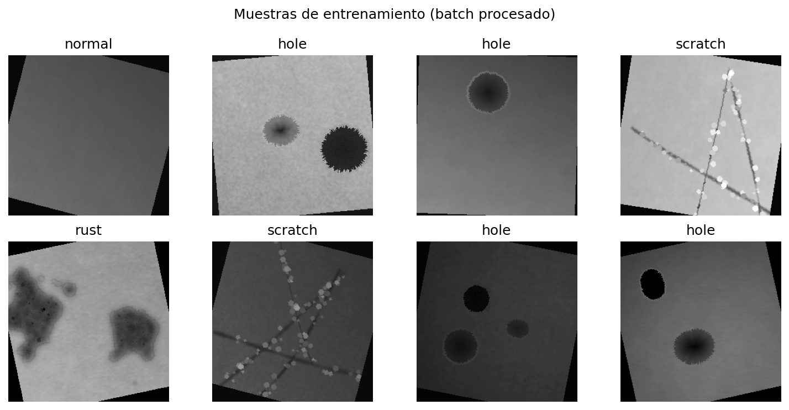

### Curvas de entrenamiento (train vs val)

| CNN básica | ResNet-18 |
|---|---|
| 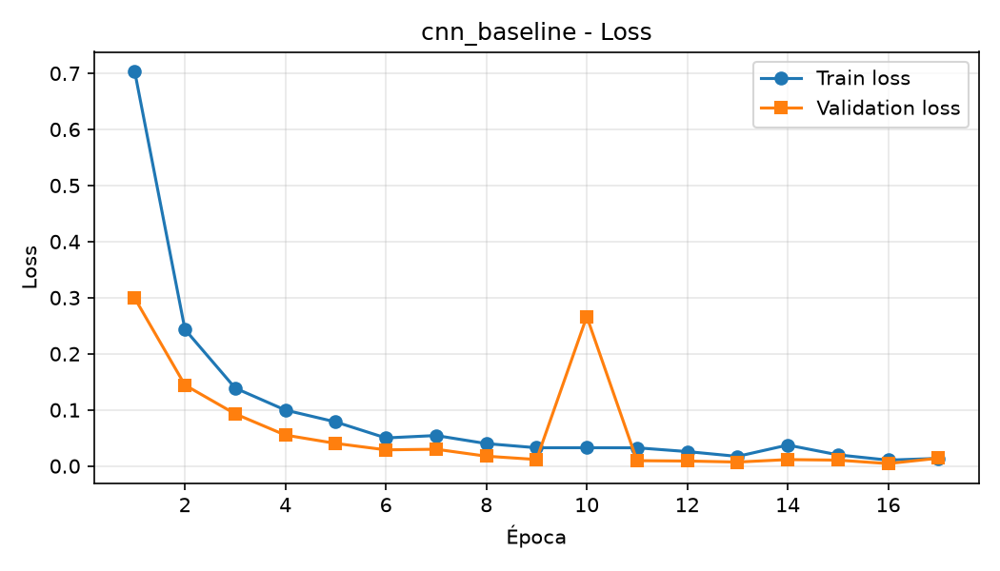 | 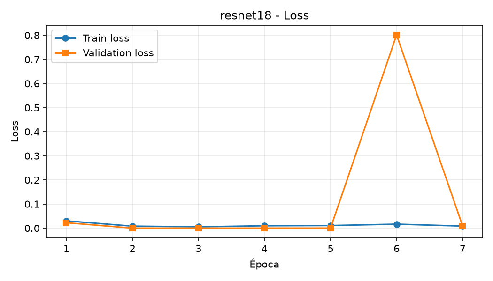 |
| 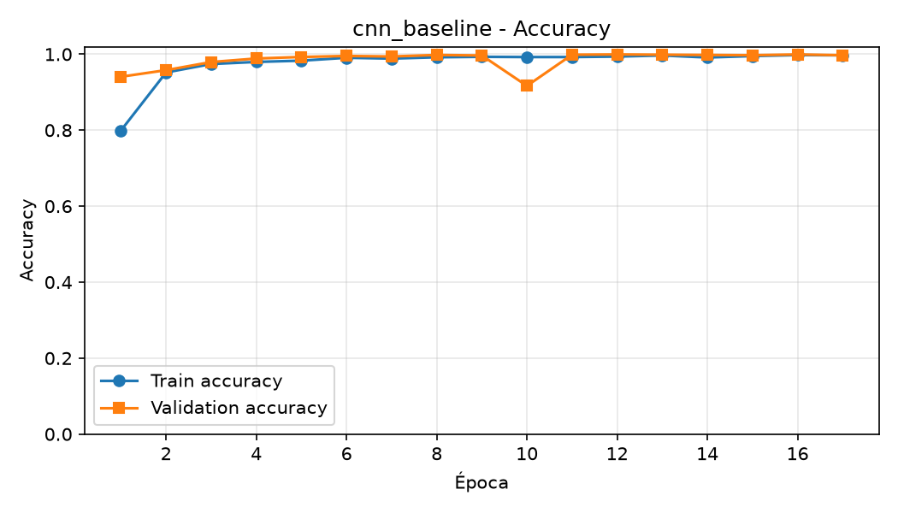 | 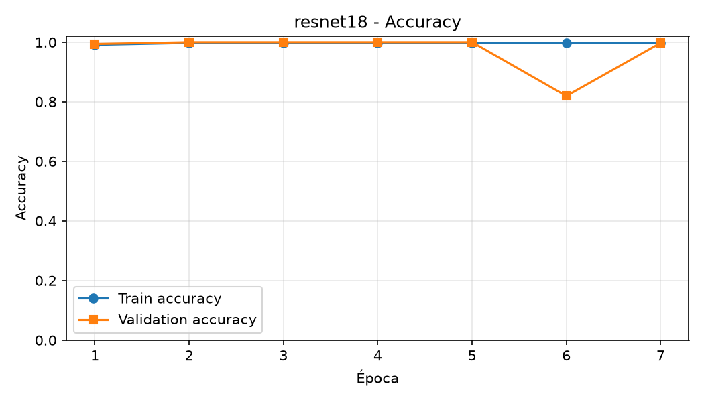 |

| EfficientNet-B0 | MobileNetV3-Small |
|---|---|
| 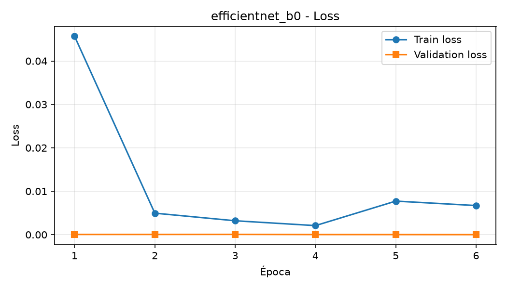 | 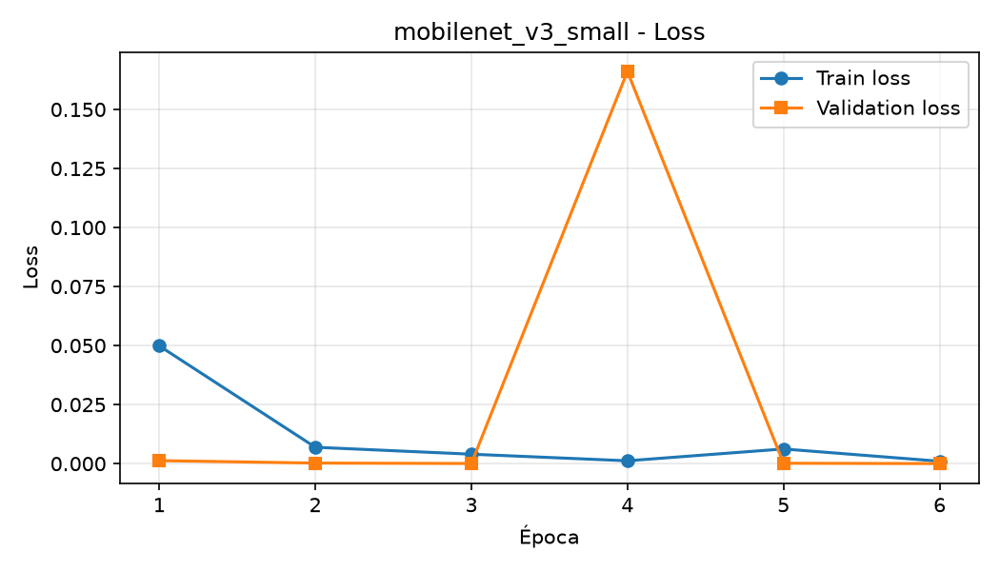 |
| 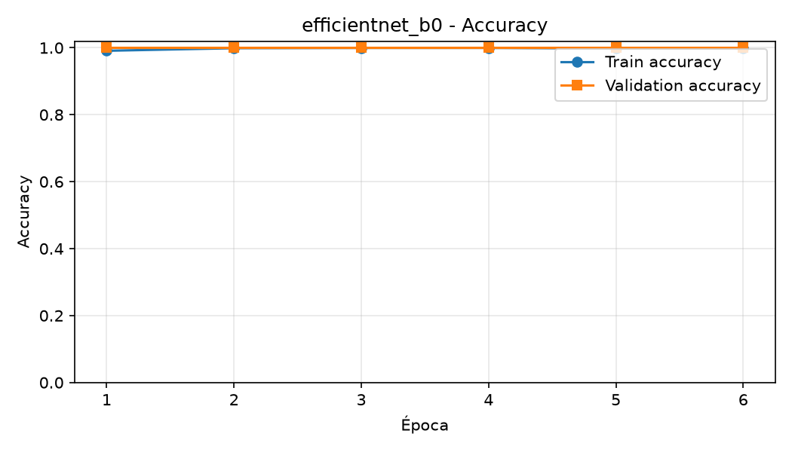 | 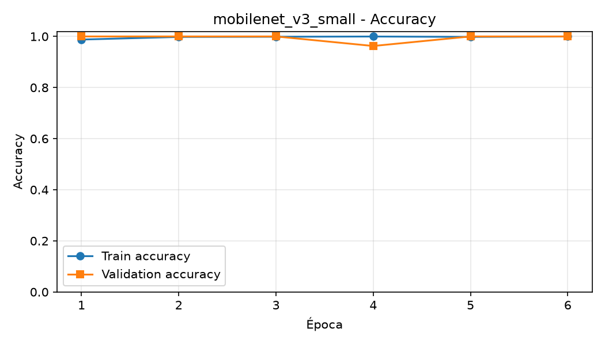 |

### Matrices de confusión (sobre test)

| CNN básica | ResNet-18 |
|---|---|
|  | 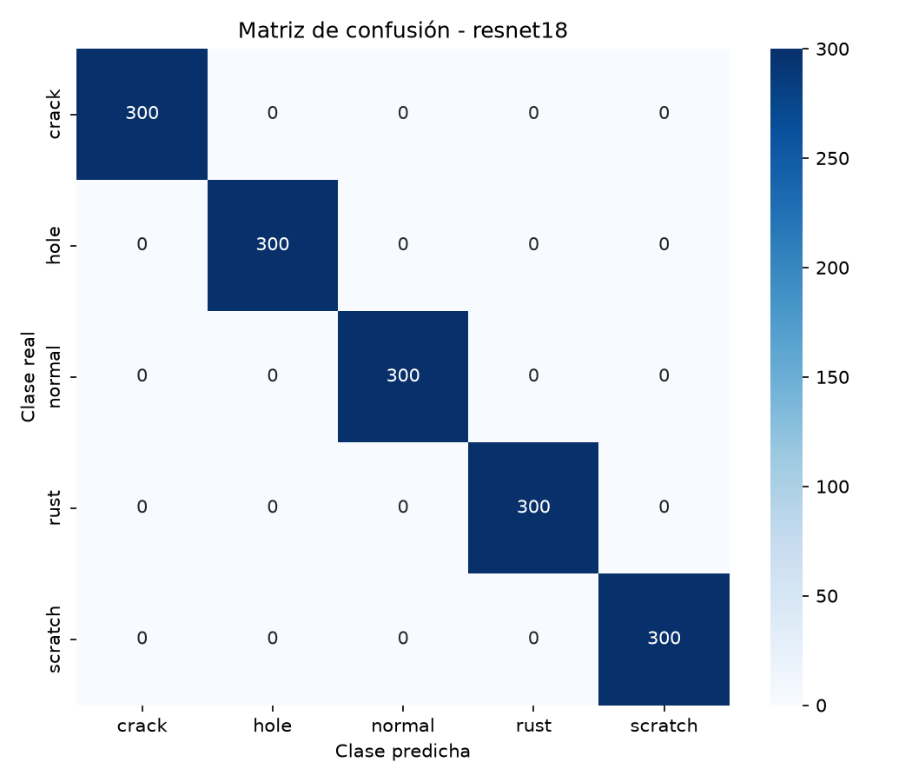 |

| EfficientNet-B0 | MobileNetV3-Small |
|---|---|
|  | 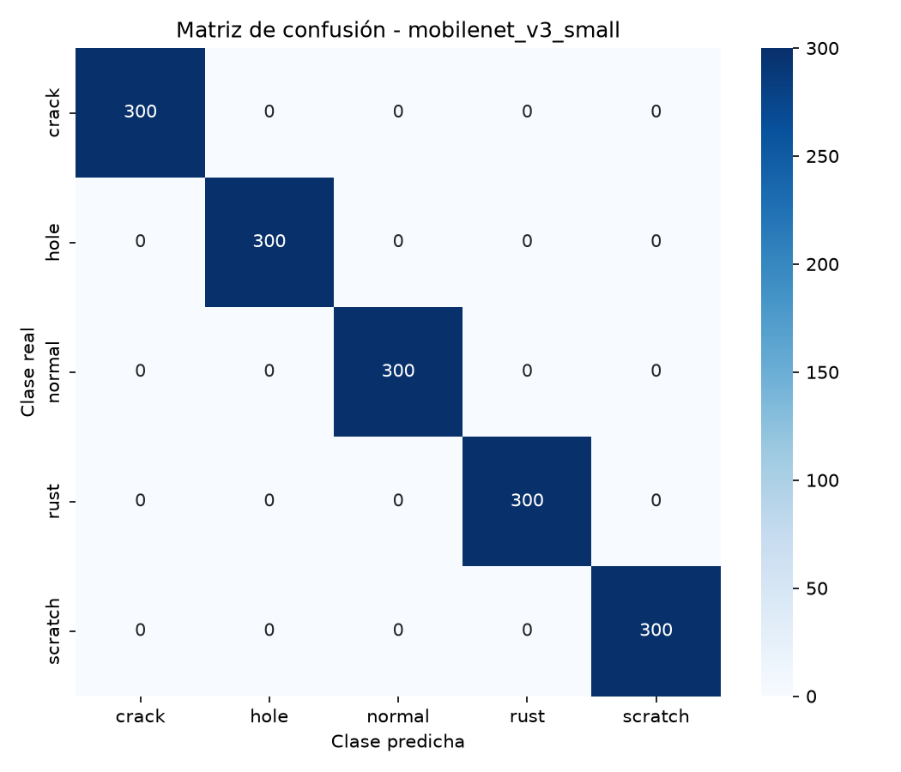 |

## Licencia

Dataset bajo **CC BY 4.0** (atribución a Tatheer Abbas). Código del proyecto para uso académico del módulo.
